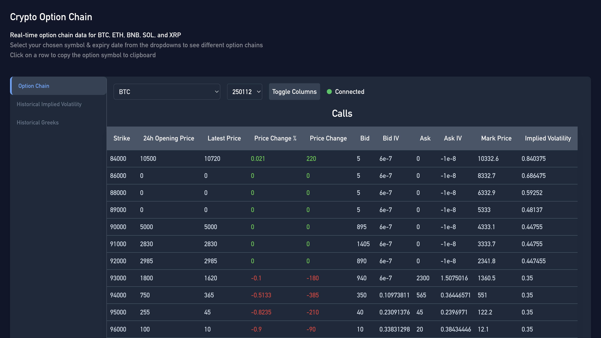
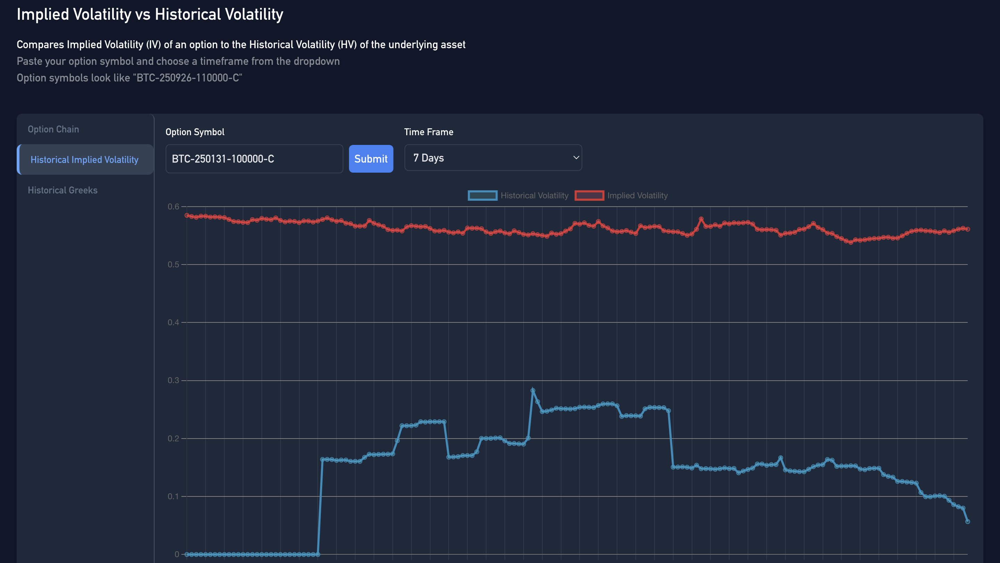
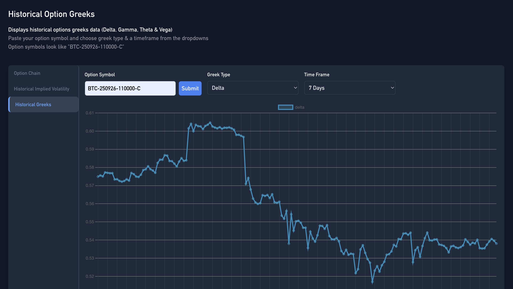

# Crypto Option Chain Analyzer 📊

## Overview

The Crypto Option Chain Analyzer is a web application that provides real-time option chain data and volatility comparisons for various cryptocurrencies. The application fetches data from multiple sources, including Binance and CoinGecko, and displays it in an interactive dashboard.

To see it live visit: [www.ivgreeks.com](https://www.ivgreeks.com)



## Features ✨

- Real-time option chain data for BTC, ETH, BNB, and more.
- Historical and implied volatility comparison.
- Greeks data for options.
- Copy option symbols to clipboard with a single click.

## Build Yourself 🛠️

If you want to build your own version: 

1. Clone the repository:
   ```bash
   git clone https://github.com/yourusername/option-pricing-dashboard.git
2. Install the dependencies:
   ```
   npm install (in option-dashboard)
   pip install -r requirements.txt
3. Start real-time WebSocket connections:
   ```
   python orchestrate_data_collection.py
4. Run the FastAPI backend:
   ```
   uvicorn app:app --reload
5. Start the development server:
   ```
   npm start
## Usage 🚀
1. Open your browser and navigate to http://localhost:3000.
2. Select your chosen symbol and expiry date from the dropdown to see different option chains.
3. Click on a row to copy the option symbol.
4. Use the volatility comparison and Greeks data features to analyze the options.


## Project Structure 📂
- `src/`: Contains the frontend React code.
- `app.py`: FastAPI backend.
- `db.py`: Database functions
- `fetch_realtime_data.py`: Fetch realtime websocket data
- `greeks.py`: Contains functions for fetching Greeks data.
- `historical_volatility.py`: Get historical volatility for an option
- `implied_volatility.py`: Get implied volatility for an option
- `iv_chart.py`: Contains functions for fetching and calculating volatility data.
- `orchestrate_data_collection.py`: Orchestrate collecting data from multiple websocket streams
- `utils.py`: Utility functions

## Screenshots 🖼️
### Option Chain 


### Historical Implied Volatility


### Historical Greeks


